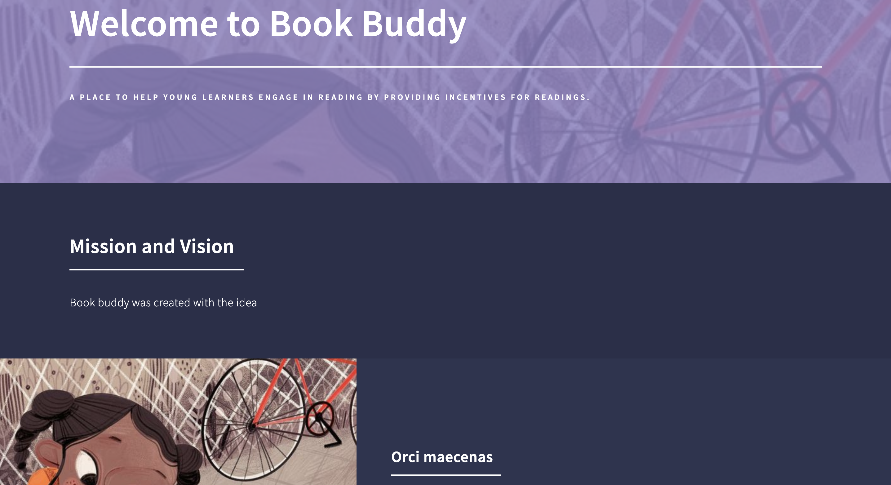
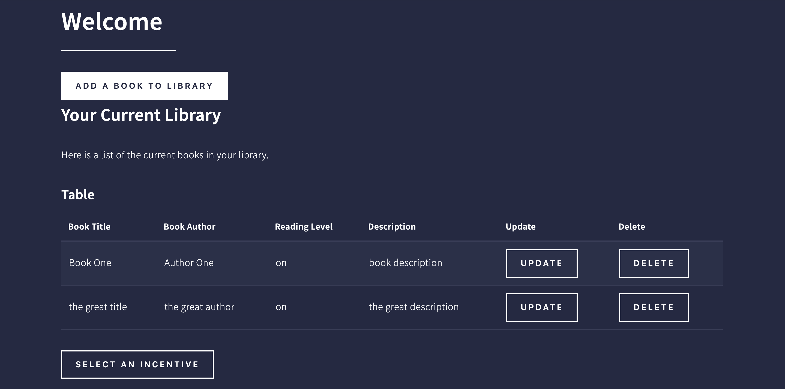
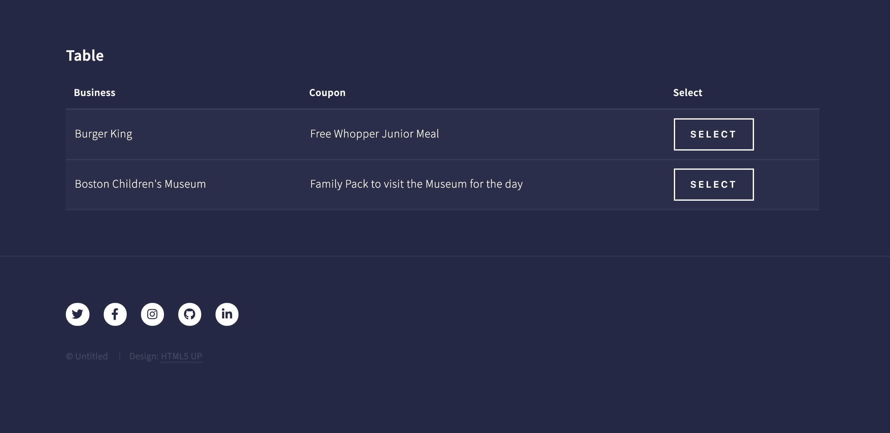

# Book Buddy Demo Day Project

## Description: Book Buddy is a web application that enables children and their families to be able to track the books that they are reading digitally. Based on the books that have been read and their difficulty level children can then choose from a variety of incentives 'coupons' from their local community.

landing page

user library page

user incentives selection page

## Technologies Used:
- ejs
- css
- bootstrap
- node.js
- mongoDB
- express
- passport

## Installation

1. Clone repo
2. run `npm install`

## Usage

1. run `node server.js`
2. Navigate to `localhost:2000`

## Credit
Template provided by HTML5up
Modified from Scotch.io's auth tutorial
